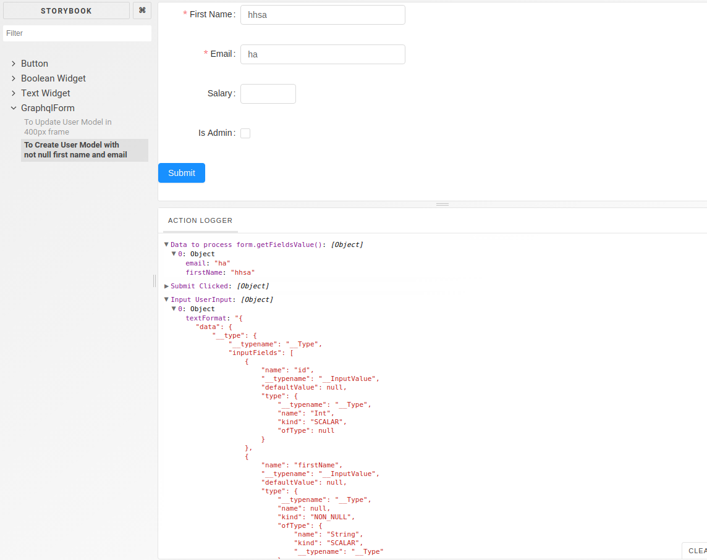

# GraphqlForm


[](https://greenkeeper.io/)
<a href="https://codeclimate.com/github/hansololai/graphql_form/maintainability"></a>
<a href="https://codeclimate.com/github/hansololai/graphql_form/test_coverage"></a>
[](https://circleci.com/gh/hansololai/graphql_form)
[](https://snyk.io//test/github/hansololai/graphql_form?targetFile=package.json)
Copy
See our Badges documentation for more details.

Severity
High
0
Medium
0
Low
0
Status
Open
0
Patched
0
## Demo

For a quick demo, visit: [graphql_form](https://hansololai.github.io/graphql_form/)

## Motivation

This project was set out to create form for submitting data with a graphql server. The setup was specifically dealing the GraphQL Input Object in mutations, like in the following form: (Result of a \_\_type query):

```
inputFields:[
	{
		name:"firstName",
		type:{
			name:"String",
			kind:"SCALAR"
		}
	},
	{
		name:"lastName",
		type:{
			name:"String",
			kind:"SCALAR"
		}
	}
]
```

As a tradition, for update mutation usually the input type name is modelName + Patch, like "UserPatch", to create a new instance of a model, the type name is "UserInput". So with input "User", it will fetch the input types of "UserPatch"/"UserInput" and based on the inputFields and generate a form for each field.

## Features

### Integrate with [Antd component library](https://ant.design/components/form/)

The form uses antd component library to create all the form items. Antd uses rc-form as the core handler for form data. Which handles field validation, field error display.

Component mapping to SCALAR type
String => <Input/>
Boolean => <Checkbox/>
Int => <Number/>
Float => <Number/>
Date/Time => <DatePicker/>/<TimePicker/>

> Does not handle custom scalar type other than Date/Time, BigFloat, BigInt

### Designed to work best with [PostGraphile](https://www.graphile.org/postgraphile/)

Following the PostGraphile definition of mutations, it uses ModelInput when form is to create a new model, and uses ModelPatch when form is to update a model. For both BigFloat and BigInt, it currently still uses <Number/>, which still converts to a Number (instead of String).

### Handles many custom value that PostGraphile defines

Enum type is handled as a Select dropdown.

### User provide custom widget

User can provide their own widget for in a text: React.Component mapping. The variable name is customWidgets. The component will be provided a "value" and "onChange". The onChange function should be called with the new value to change the value in the form.

### Customized validator and rules

User can supply a mapping of validator and rules for each field that will be used by async-validator. variable name are "customValidators" and "customRules". You can find more about the "validator" function and "rule" object in the antd form doc. The User can also provide a mapping of decorators (customDecorators), the decorator is also documented in antd form. The decorator sets many ectra things such as the label, it also allows validator and rules, but they will be overwritten by the customValidators and customRules.

### Auto validate the fields before submit

If an onSubmit function is passed in, the onSumit function will be called with a "form" object, which has several important functions, such as getFieldsData, validateFields, getFieldsError etc. The function will not be called if the input is invalid. The validation is done using another library (embedded in the form) [async-validator](https://github.com/yiminghe/async-validator). This form is created by Antd Form.create() hoc, which internally uses [rc-form](http://react-component.github.io/form/)

### Uses [Apollo Client](https://www.apollographql.com/docs/react/api/apollo-client)

It uses Apollo Client <Query> which is a very helpful client library for graphql data cache and normalization.

### Uses Typescript

The components are developed with typescript

### Uses Storybook for Demo



## Get Started

Not ready for publish to NPM yet, working on doc and refactoring.

Simply import the GraphqlForm object and pass in modelName and onSumit to generate a form.

## Roadmap

The project was made originally for a project with PostGraphile, so a lot of features were leaning toward it. A great follow up feature would be:

### Use a Select for a association

The input object generated by PostGraphile are all scalar including foreignKeys, so it is not possible to know its association, however, the model may have associated inflectors, for example, a PostInput will have a userId inputField that is Int, but the Post object may have a field called UserByUserId, that is a "User" object. Using this combined information, the library may be able to "guess" the association on a field, and render a Select dropdown for belongs_to association.
However, if --simplify-inflector is used, then it will be harder todo.

### Handle other type of data from postgres

Postgresql table field can be many other data types, such as List, which is not supported yet.

## MIT License
